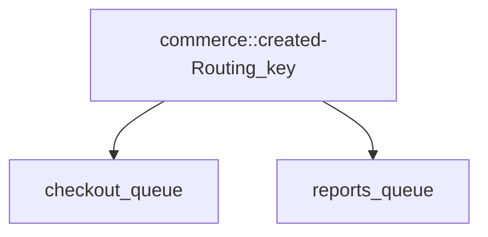

# escuela-php-PIGEON
# Pigeon

This library was created thinking to bring an easy way to connect two or more applications through protocol AMQP,
this library is focus on encrypted Messages
## Installation

First you have to go to PHP.ini and delete the ';' of the line openssl to active it.

To Install the library you only have to do is add the message broker in .endor file,
later you have to execute composer update in the terminal.

To publish the configuration file for hermes execute this command into your project.

bash
php artisan vendor:publish --tag=pigeon


You will now find the config file located in /config/pigeon.php

## Configuration

### Host Configuration

| Variable                  | Description                                                      | Default value  |
|---------------------------|------------------------------------------------------------------|----------------|
| PIGEON_RABBITMQ_HOST          | The host to connect                                           | 127.0.0.1      |
| PIGEON_RABBITMQ_HOST_PORT     | Port to be used to connect to amq host                        | 5672           |
| PIGEON_RABBITMQ_USERNAME      | User to be used to authenticate against host                  | guest          |
| PIGEON_RABBITMQ_PASSWORD      | Password to be used to authenticate against host              | guest          |
| PIGEON_RABBITMQ_VHOST         | Vhost to be used to connect to amq host                       | /              |
| AMQP_SSL_PROTOCOL  | Indicates the ssl protocol to use when connecting to the host           | ssl            |

### SSL Configuration

| Variable                  | Description                                                      | Default value  |
|---------------------------|------------------------------------------------------------------|----------------|
| PIGEON_RABBITMQ_SSL_CAFILE      | Name of the exchange to use                                 | null           |
| PIGEON_RABBITMQ_SSL_LOCAL_CERT  | Type of exchange to be used                                 | null           |
| PIGEON_RABBITMQ_SSL_LOCAL_KEY   | Name to the queue to be connected                           | null           |
| PIGEON_RABBITMQ_SSL_VERIFY_PEER | Name to the queue to be connected                           | null           |
| PIGEON_RABBITMQ_SSL_PASSPHRASE  | Name to the queue to be connected                           | null           |

### Queue and Exchange Configuration

| Variable                  | Description                                                      | Default value  |
|---------------------------|------------------------------------------------------------------|----------------|
| PIGEON_RABBITMQ_EXCHANGE_NAME | Name of the exchange to use                                   | direct_exchange|
| PIGEON_RABBITMQ_EXCHANGE_TYPE | Type of exchange to be used                                   | direct         |
| PIGEON_RABBITMQ_QUEUE_NAME    | Name to the queue to be connected                             | queue          |

### Signature Configuration

| Variable                  | Description                                                      | Default value       |
|---------------------------|------------------------------------------------------------------|---------------------|
| PIGEON_SIGNATURE_ALGORITHM | Algorithm that will be used                                    | OPENSSL_ALGO_SHA256 |
| PIGEON_SIGNATURE_PUBLICKEY_PATH | path to the publickey                                | null                |
| PIGEON_SIGNATURE_PRIVATEKEY_PATH    | path to the privatekey                        | null                |

### Encryption Configuration

| Variable                  | Description                                                      | Default value     |
|---------------------------|------------------------------------------------------------------|-------------------|
| PIGEON_ENCRYPT_SECRETKEY | secretkey used in Signature                                     | CLASS-MESSAGE-KEY |
| PIGEON_ENCRYPT_METHOD | method used to Encrypt                                           | AES-256-CBC       |
| PIGEON_ENCRYPT_ALGORITHM    | Algorithm used to Encrypt                              | sha256            |

## Create Events

To create a new event you need to run in terminal command php artisan make event 'CommerceCreatedEvent'


To create a new event you need to run in terminal command php artisan make listener 'CommerceCreatedListener'


## Events Configuration

Events are dispatched based on the routing key, you must configure your events according to the routing keys in your exchange for example:


### school_exchange



```php
'events' => [
    'commerce::created' => CommerceCreatedEvent::class
    'your_routing_key' => YourEventClass::class
]
```
## Usage/Examples

### Publish

```php
use E4\Pigeon\Facades\pigeon;

pigeon::publish('commerce::created', $request->all());
```

### Listening Command For Consume

The command will facilitate the consumption of the queue as well as decrypt the information and dispatch the events.

```bash
php artisan pigeon:listen
```
Use the queue of the config file

```bash
php artisan pigeon:listen --queue=reports
```
For indicate the queue to consume

You can set the command as a task in in the schedule method of your application's `App\Console\Kernel` class.

```php
class Kernel extends ConsoleKernel
{

    protected $commands = [];
    
    protected function schedule(Schedule $schedule)
    {
        $schedule->command('pigeon:listen')->everyFiveMinutes();
    }
}
```

### Consume

```php
use E4\Pigeon\Facades\pigeon;

pigeon::consume(function (AMQPMessage $message) {
    print_r($message->body);
});

```


## Demo

https://github.com/FrederST/e4-pigeon-demo


## Authors

- [@jhonJa](https://github.com/Johnja85)

- [@MarceloDelaHoz](https://github.com/rainychelo)

- [@FrederHernandez](https://github.com/FrederST)

- [@VictorMonroy](https://github.com/VictorMonroyHz)

- [@RodrigoGallego](https://github.com/ragallegom)

- [@ChristianValencia](https://github.com/xfchris)